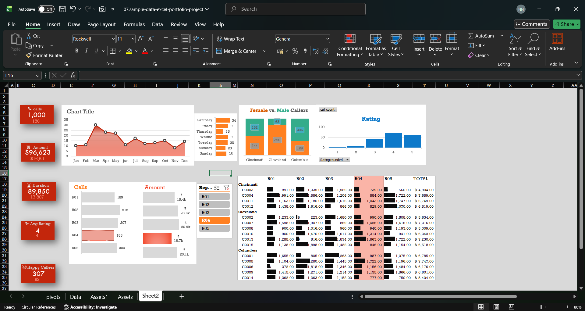

# 📊 Interactive Excel Call Centre Dashboard

## 📌 Project Overview

This project is an interactive **Call Centre Performance Dashboard** built using Microsoft Excel.

The dashboard transforms call centre data into interactive visualizations and KPIs to help analyze call performance, customer satisfaction, purchase behavior, call duration, and representative performance.

---

## 🎯 Business Objective

The objective of this dashboard is to analyze call centre performance and provide an easy-to-use reporting solution for understanding key performance indicators and identifying patterns in the data.

---

## 🔍 Analysis Performed

The dashboard provides analysis of:

- 📞 Call Centre Performance
- 📅 Monthly Call Trends
- 💰 Purchase Amount
- ⏱️ Call Duration
- 😊 Customer Satisfaction
- 👤 Representative Performance

---

## 📊 Dashboard Features

- KPI Cards
- Interactive Slicers
- Pivot Tables
- Pivot Charts
- Interactive Visualizations
- Conditional Formatting
- Excel Functions
- Representative Performance Analysis

---

## 🛠️ Tools & Technologies

- Microsoft Excel 2021
- Pivot Tables
- Pivot Charts
- Slicers
- Conditional Formatting
- Excel Functions
- Data Visualization

---

## 🖥️ Dashboard Preview

---

## 📁 Project Files

- `Interactive-Call-Centre-Dashboard.xlsx` — Excel dashboard
- `dashboard-preview.png` — Dashboard preview
- `README.md` — Project documentation

---

## 💡 Key Skills Demonstrated

- Data Analysis
- Data Visualization
- Dashboard Development
- KPI Reporting
- Excel Data Analysis
- Business Reporting
- Interactive Dashboard Design

---

## 👩‍💻 Author

**Nikhila Neeli**

Aspiring Data Analyst | SQL • Excel • Python • Power BI

[LinkedIn](https://www.linkedin.com/in/neeli-nikhila-06b8362a1/)
